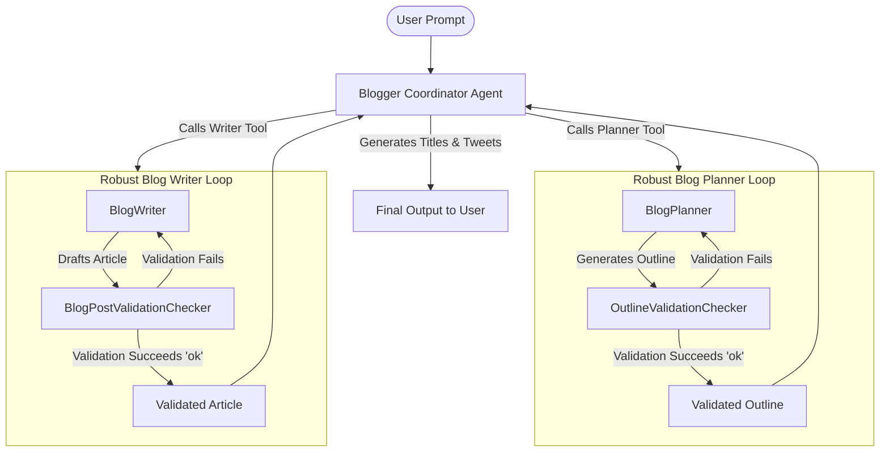
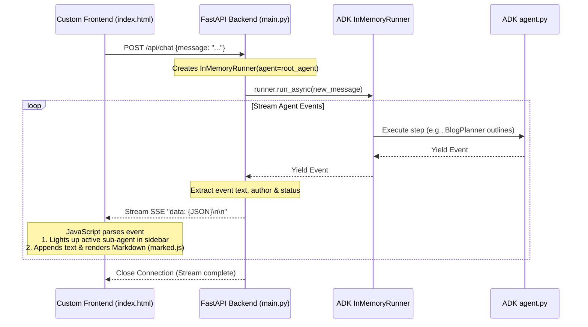

# ADK Blogger Agent & Chat UI Codelab Guide

This project implements a **Deliberative/Planning Multi-Agent Blog-Writing System** using Google's **Agent Development Kit (ADK)** and Gemini in Python. It features two user interfaces:
1. **Standard ADK Web UI**: The official built-in graph UI that shows the execution traces of loops and agents.
2. **Premium Custom Chat UI**: A custom-designed, glassmorphic dark-mode web interface with real-time Server-Sent Events (SSE) streaming, Markdown rendering, syntax highlighting, and visual indicators tracking which sub-agent is currently executing.

---

## 1. Architecture Overview

Unlike a basic single-prompt LLM, this system utilizes a **deliberative planning loop** that mimics how human writers work:



- **Blogger (Coordinator)**: Receives the topic, dispatches the planning phase, passes the outline to the writing phase, and appends alternate titles and social media hooks.
- **BlogPlanner**: Generates a structured Markdown outline.
- **OutlineValidationChecker**: Ensures the outline meets structural parameters (title, intro, 4-6 sections, conclusion).
- **RobustBlogPlanner**: A `LoopAgent` that runs validation and retries outline planning up to 3 times on failure.
- **BlogWriter**: Produces the technical blog post in Markdown based on the outline.
- **BlogPostValidationChecker**: Reviews the post structure and technical clarity.
- **RobustBlogWriter**: A `LoopAgent` that retries writing up to 3 times on failure.

---

## 2. User Interfaces & Code Flow

This project implements two different ways to interface with the ADK Blogger Agent. Below is a detailed look at how they work and the corresponding code flows.

### Option A: Standard ADK Web UI
The Standard Web UI is provided out-of-the-box by the `google-adk` framework.
* **How it runs**: When you run `adk web` in your terminal, the ADK CLI starts its built-in FastAPI web server. It scans the current directory, finds the `root_agent` exposed in your package, and mounts it.
* **Flow**:
  1. The pre-built React/TypeScript frontend asks the server for the agent's definition.
  2. The UI renders the agent's hierarchical graph structure showing the connection between `Blogger`, `RobustBlogPlanner`, and `RobustBlogWriter`.
  3. During execution, it streams the full system execution logs and tool outputs, showing you exactly when checkers validate or trigger retries.

### Option B: Premium Custom Chat UI
The Premium Custom Chat UI uses a custom FastAPI backend (`main.py`) to stream events directly to a custom HTML/CSS/JS frontend (`static/index.html`) using **Server-Sent Events (SSE)**.



#### 1. Backend Event Streaming (`main.py`)
In `main.py`, we instantiate the ADK `InMemoryRunner` for our agent:
```python
runner = InMemoryRunner(agent=root_agent)
runner.auto_create_session = True
```
When `/api/chat` is hit, it starts `runner.run_async()` asynchronously. As the multi-agent system runs, the runner yields `Event` objects representing text output chunks and transitions. We serialize these events and stream them to the browser:
```python
async for event in runner.run_async(user_id=user_id, session_id=session_id, new_message=user_msg):
    data = {
        "author": event.author,      # Active agent name (e.g., "BlogPlanner", "BlogWriter")
        "text": text_content,        # Streamed text tokens
        "output": event.output,      # Final agent output payload
        "node_path": event.node_info.path if event.node_info else None
    }
    yield f"data: {json.dumps(data)}\n\n"
```

#### 2. Frontend Real-Time Client (`static/index.html`)
The frontend uses JavaScript to parse this real-time stream:
* **Streaming Consumer**: The browser uses `fetch()` and consumes the response stream using `response.body.getReader()`. It reads and decodes the stream chunk-by-chunk.
* **Sub-Agent Tracking**: When a chunk arrives with a new `data.author`, the script automatically selects the corresponding step in the sidebar (e.g. `step-BlogPlanner`, `step-BlogWriter`) and marks it `.active` (making it glow purple) or `.done` (making it green).
* **Live Markdown Rendering**: It appends new tokens to a cumulative text buffer and runs it through `marked.parse(fullText)` to generate HTML on the fly. It then triggers `Prism.highlightAllUnder(...)` to highlight python or bash code blocks in the article.

---

## 3. Local Setup & Installation

### Prerequisites
- Python 3.10 or higher.
- A Google AI Studio API Key. Get one at [Google AI Studio](https://aistudio.google.com/app/api-keys).

### Steps
1. **Clone or navigate to the directory**:
   ```bash
   cd bloggeragent
   ```

2. **Create and activate a Python virtual environment**:
   ```bash
   python3 -m venv .venv
   source .venv/bin/activate
   ```

3. **Install Dependencies**:
   ```bash
   pip install -r requirements.txt
   ```

4. **Configure Credentials**:
   Open the `.env` file in the root of the project and add your API key:
   ```env
   GOOGLE_API_KEY=your_gemini_api_key_here
   MODEL=gemini-3.5-flash
   ```

---

## 4. Running Locally

### Option A: Standard ADK Web UI
This runs the official ADK interactive web console.
```bash
adk web
```
- Open your browser to `http://127.0.0.1:8000` (if port 8000 is taken, use `adk web --port 8001`).
- Enter a topic like `How to build an AI agent using planning loops` and observe the visual execution graph showing the sub-agents and checkers running.

### Option B: Premium Custom Chat UI (Recommended)
This runs the custom-built glassmorphic web app with real-time SSE streaming.
```bash
python main.py
```
- Open your browser to `http://localhost:8080` (or the port shown in your terminal).
- Enter a topic and watch as the sidebar steps light up, showing which specialist agent (Planner, Checker, Writer) is active in real-time as text streams onto the page.

---

## 5. Deploying to Google Cloud Run

To deploy your agent to Google Cloud, you need a Google Cloud Project with billing enabled.

### 1. Install Google Cloud CLI (gcloud)

If you do not have the Google Cloud CLI (`gcloud`) installed on your machine, select one of the options below:

* **Option A: Using Homebrew (macOS)**
  ```bash
  brew install --cask google-cloud-sdk
  ```
  *(Restart your terminal session after installation)*

* **Option B: Using the Interactive Installer Script (macOS/Linux)**
  ```bash
  curl https://sdk.cloud.google.com | bash
  exec -l $SHELL
  gcloud init
  ```

* **Option C: Windows**
  Download and run the official [Google Cloud CLI Installer](https://dl.google.com/dl/cloudsdk/channels/rapid/GoogleCloudSDKInstaller.exe).

### 2. Authenticate with Google Cloud CLI
Once installed, log in to your Google Cloud account in your terminal:
```bash
gcloud auth login
gcloud auth list
```

### 3. Configure Your Cloud Project
Set your active project ID:
```bash
gcloud config set project <YOUR_PROJECT_ID>
```
Enable the required Cloud APIs:
```bash
gcloud services enable \
  run.googleapis.com \
  artifactregistry.googleapis.com \
  cloudbuild.googleapis.com
```

### 4. Grant Permissions
Retrieve your project number:
```bash
gcloud projects describe <YOUR_PROJECT_ID> --format="value(projectNumber)"
```
Grant the Cloud Build builder role to the default compute service account:
```bash
gcloud projects add-iam-policy-binding <YOUR_PROJECT_ID> \
  --member="serviceAccount:<PROJECT_NUMBER>-compute@developer.gserviceaccount.com" \
  --role="roles/cloudbuild.builds.builder"
```
Grant Vertex AI User permissions to the service account (allowing the Cloud Run instance to invoke Gemini without requiring an API key):
```bash
gcloud projects add-iam-policy-binding <YOUR_PROJECT_ID> \
  --member="serviceAccount:<PROJECT_NUMBER>-compute@developer.gserviceaccount.com" \
  --role="roles/aiplatform.user"
```

### 5. Deploying

#### Option A: Deploy the Built-in ADK Web UI
Run this command from the project root:
```bash
export PROJECT_ID="<YOUR_PROJECT_ID>"

adk deploy cloud_run \
  --project=$PROJECT_ID \
  --region=us-east1 \
  --service_name=bloggeragent \
  --with_ui \
  . \
  -- \
  --set-env-vars GOOGLE_GENAI_USE_VERTEXAI=TRUE,MODEL=gemini-3.5-flash,GOOGLE_CLOUD_LOCATION=global
```
- Confirm repository creation when prompted (type `Y`).
- Allow unauthenticated invocations (type `y`).
- Once finished, open the provided URL to access the official Web UI!

#### Option B: Deploy the Custom Chat UI
Run this command from the project root using the provided `Dockerfile`:
```bash
gcloud run deploy bloggeragent-custom \
  --source . \
  --region=us-east1 \
  --allow-unauthenticated \
  --set-env-vars GOOGLE_GENAI_USE_VERTEXAI=TRUE,MODEL=gemini-3.5-flash,GOOGLE_CLOUD_LOCATION=global
```
- Open the resulting service URL in your browser to interact with your customized Glassmorphic Blogger interface live on Google Cloud!

---

## 6. Clean Up

To prevent ongoing charges, delete the deployed Cloud Run services and Artifact Registry repositories:

```bash
# Delete custom service
gcloud run services delete bloggeragent-custom --region=us-east1 --quiet

# Delete ADK service
gcloud run services delete bloggeragent --region=us-east1 --quiet

# Delete Artifact Registry repositories
gcloud artifacts repositories delete cloud-run-source-deploy --location=us-east1 --quiet
```
